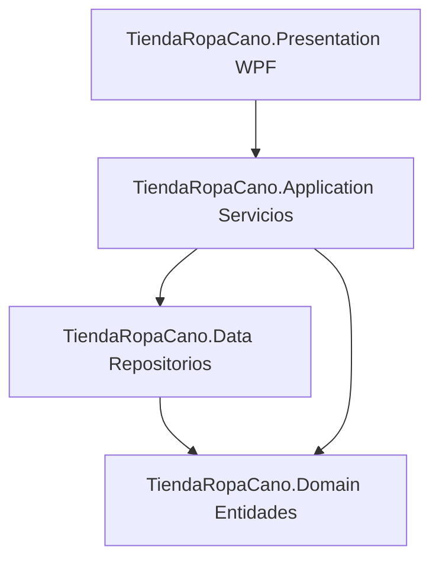

# Documentación del Proyecto - TiendaRopaCano

Este documento proporciona una descripción general completa de la arquitectura, estructura de archivos y clases del proyecto **TiendaRopaCano**. Está diseñado para facilitar la revisión del código y comprender cómo interactúan los diferentes componentes de la aplicación.

---

## 1. Arquitectura del Sistema
El proyecto está desarrollado bajo la **Arquitectura en Capas** de .NET, lo que garantiza la separación de responsabilidades, alta mantenibilidad y desacoplamiento de componentes. El flujo de dependencias va de afuera hacia adentro (la presentación depende de la aplicación, esta de los datos y el dominio es el núcleo central).



---

## 2. Tecnologías Utilizadas
* **Lenguaje de Programación:** C# (.NET 10.0 / Windows Desktop SDK)
* **Interfaz de Usuario:** WPF (Windows Presentation Foundation) con XAML.
* **Patrón de UI:** MVVM (Model-View-ViewModel) implementado mediante **CommunityToolkit.Mvvm** (generadores de código para propiedades observables y comandos de relevo).
* **Acceso a Datos:** **Dapper** (Micro-ORM rápido y ligero para ejecutar consultas SQL).
* **Motor de Base de Datos:** **SQLite** (Base de datos local e integrada, controlada a través del proveedor `Microsoft.Data.Sqlite`).
* **Generación de Reportes:** **QuestPDF** (Generación fluida de archivos PDF).

---

## 3. Estructura de Directorios del Proyecto

A continuación se detalla la función de cada proyecto dentro de la solución:

```
TiendaRopaCano/
│
├── TiendaRopaCano.slnx             # Archivo de solución XML moderno de Visual Studio
├── DiagramaClases.puml             # Diagrama de clases conceptual en formato PlantUML
│
├── TiendaRopaCano.Domain/          # Núcleo de la aplicación (Entidades de Negocio)
│   └── Entidades/                  # Clases pojo puras de C# sin dependencias externas
│
├── TiendaRopaCano.Application/    # Orquestación y lógica de negocio (Servicios)
│   ├── Helpers/                    # Utilidades de negocio (ej. hasheo de contraseñas PBKDF2)
│   └── Services/                   # Interfaces e implementaciones de servicios de negocio
│
├── TiendaRopaCano.Data/            # Capa de infraestructura y persistencia a Base de Datos
│   ├── Context/                    # Inicialización y configuración de conexión SQLite
│   ├── Repositorios/               # Interfaces e implementaciones de consultas SQL (Dapper)
│   └── Scripts/                    # Archivos SQL para la creación inicial de base de datos
│
└── TiendaRopaCano.Presentation/    # Capa de Interfaz Gráfica de Usuario (WPF UI)
    ├── Helpers/                    # Convertidores XAML y gestor de sesión local
    ├── ViewModels/                 # Lógica de presentación y enlace de datos (MVVM)
    └── Views/                      # Archivos de interfaz gráfica (.xaml y code-behind .xaml.cs)
```

---

## 4. Detalle de Clases y Responsabilidades

### 4.1. Capa de Dominio (`TiendaRopaCano.Domain`)
Contiene las entidades puras que modelan el negocio. Se encuentran en la carpeta `Entidades/`:

| Clase | Descripción | Propiedades Clave |
| :--- | :--- | :--- |
| **`Usuario`** | Representa a un empleado o administrador con credenciales de acceso. | `UsuarioId`, `NombreCompleto`, `NombreUsuario`, `Contrasena` (Hash), `RolId`, `Activo` |
| **`Rol`** | Define los roles de seguridad en el sistema (ej. Administrador, Vendedor). | `RolId`, `Nombre` |
| **`Producto`** | Modela una prenda de vestir o artículo de inventario. | `ProductoId`, `CategoriaId`, `Nombre`, `Precio`, `PrecioCompra`, `Stock`, `StockMinimo` |
| **`Categoria`** | Agrupa productos del mismo tipo (ej. Camisas, Pantalones). | `CategoriaId`, `Nombre`, `Descripcion` |
| **`Venta`** | Cabecera de la transacción de una venta. | `VentaId`, `UsuarioId`, `Fecha`, `Total`, `Detalles` (Lista) |
| **`DetalleVenta`**| Línea individual de productos vendidos dentro de una venta. | `DetalleId`, `VentaId`, `ProductoId`, `Cantidad`, `PrecioUnitario`, `Subtotal` |
| **`AlertaStock`** | Alerta generada automáticamente si un producto tiene bajas existencias. | `AlertaId`, `ProductoId`, `StockActual`, `StockMinimo`, `Fecha`, `Revisada` |
| **`LogError`** | Guarda trazas de excepciones ocurridas en el sistema para auditoría. | `LogId`, `Fecha`, `Modulo`, `Accion`, `MensajeError`, `DetalleError` |
| **`ReporteVentaDiaria`** | Estructura de agregación para resumir el total financiero de un día. | `Fecha`, `TotalVentas`, `TotalCosto`, `Utilidad`, `CantidadVentas` |

---

### 4.2. Capa de Aplicación (`TiendaRopaCano.Application`)
Orquesta los flujos de trabajo e implementa las reglas de negocio globales.

#### **Servicios e Interfaces (`Services/`)**
* **`IUsuarioService` / `UsuarioService`:** Maneja la lógica de creación de usuarios, desactivación y autenticación (incluye validación contra hash PBKDF2).
* **`IProductoService` / `ProductoService`:** Controla altas, bajas y cambios de productos. Valida e inserta registros de alerta de stock bajo automáticamente al actualizar inventarios.
* **`IVentaService` / `VentaService`:** Registra ventas de forma atómica y valida que exista inventario suficiente antes de descontar stock de los productos vendidos.
* **`ICategoriaService` / `CategoriaService`:** Administra las categorías del catálogo de ropa.
* **`IRolService` / `RolService`:** Consulta los perfiles de usuario disponibles.
* **`IPdfService` / `PdfService`:** Utiliza **QuestPDF** para construir en memoria arreglos de bytes PDF de facturas de venta, reportes financieros y catálogos de stock.
* **`IReporteService` / `ReporteService`:** Consolida datos para reportes y exporta información de inventario y ventas a formato plano CSV.

#### **Helpers (`Helpers/`)**
* **`EncriptadorContrasena` (en `PasswordHasher.cs`):** Utiliza la derivación de claves PBKDF2 (`Rfc2898DeriveBytes`) de forma segura con salt aleatorio e iteraciones parametrizadas para proteger las contraseñas.

---

### 4.3. Capa de Datos e Infraestructura (`TiendaRopaCano.Data`)
Maneja de forma directa la comunicación con la base de datos local SQLite.

#### **Configuración (`Context/`)**
* **`ConfiguracionBaseDatos` (en `DatabaseConfig.cs`):** Crea y provee instancias de conexión abierta `SqliteConnection` a partir de una cadena de conexión. Adicionalmente, cuenta con el método `InicializarBaseDeDatos()` para leer un recurso SQL embebido y crear las tablas e insertar registros semilla (como el usuario administrador por defecto) al iniciar la aplicación por primera vez.

#### **Repositorios e Interfaces (`Repositorios/`)**
Implementan consultas SQL puras mapeadas eficientemente por Dapper:
* **`IAlertaRepository` / `AlertaRepository`:** Inserción de alertas de stock mínimo.
* **`ICategoriaRepository` / `CategoriaRepository`:** Operaciones CRUD para categorías.
* **`ILogErrorRepository` / `LogErrorRepository`:** Registro no estructurado de logs de excepciones.
* **`IProductoRepository` / `ProductoRepository`:** Consultas avanzadas de inventario con LEFT JOINs para mapear categorías, actualización de unidades y listado de stock bajo.
* **`IReporteRepository` / `ReporteRepository`:** Agregaciones financieras (SUM, COUNT) con GROUP BY de base de datos para calcular utilidades diarias.
* **`IRolRepository` / `RolRepository`:** Consulta de catálogos de roles.
* **`IUsuarioRepository` / `UsuarioRepository`:** Operaciones de persistencia y estado activo de cuentas de usuario.
* **`IVentaRepository` / `VentaRepository`:** Registro de ventas utilizando **transacciones de base de datos** (`DbTransaction`) para garantizar la integridad e integridad referencial del inventario al descontar piezas vendidas.

---

### 4.4. Capa de Presentación (`TiendaRopaCano.Presentation`)
Interfaz de usuario de WPF orientada al patrón MVVM.

#### **ViewModels (`ViewModels/`)**
Proporcionan propiedades enlazables (Data Binding) y comandos que son consumidos por las Vistas XAML:
* **`LoginViewModel`:** Captura usuario y contraseña, efectúa el login y abre la ventana principal.
* **`MainViewModel`:** Orquesta la navegación lateral del panel de menú principal e identifica los permisos del usuario activo para habilitar o deshabilitar pestañas.
* **`InventarioViewModel` / `ProductoDialogViewModel`:** Controlan la grilla de productos, edición, creación e impresión del PDF de inventario completo o de bajo stock.
* **`VentasViewModel` / `NuevaVentaViewModel`:** Lógica para facturación en caja, escaneo/selección de prendas, cálculo dinámico de subtotales, totales y generación del ticket PDF.
* **`UsuariosViewModel` / `UsuarioDialogViewModel`:** Pantallas para el mantenimiento de empleados y sus accesos al sistema.
* **`CategoriaViewModel`:** Mantenimiento rápido de las marcas y grupos de prendas.
* **`ReportesViewModel`:** Selecciona rangos de fechas para graficar o generar reportes exportables en PDF y CSV.

#### **Helpers (`Helpers/`)**
* **`GestorSesion` (en `SessionManager.cs`):** Almacena de forma estática en memoria el objeto `Usuario` activo en la sesión y expone banderas de rol (ej. `EsAdministrador`).
* **`BoolToVisibilityConverter`:** Traduce estados booleanos del ViewModel a visibilidades en la UI de WPF.
* **`PasswordHelper`:** Propiedad adjunta para permitir el enlace bidireccional seguro de la contraseña desde un control `PasswordBox` hacia el ViewModel sin romper MVVM.

#### **Views (`Views/`)**
Archivos `.xaml` que contienen el diseño visual (Grid, Buttons, TextBox) y código `.xaml.cs` (code-behind) encargado estrictamente de inicializar el componente y enlazar su `DataContext` al ViewModel correspondiente.

---

## 5. Integridad del Código y Comentarios XML
Todas las clases públicas, interfaces, constructores, métodos y propiedades del proyecto han sido provistos con comentarios XML estándar de C# en **español** (`/// <summary>`). Al desarrollar en IDEs como Visual Studio o VS Code:
1. Al pasar el cursor sobre cualquier clase, propiedad o método del sistema, aparecerá un cuadro informativo (Tooltip) describiendo su funcionamiento y parámetros.
2. Es posible habilitar la generación del archivo XML de documentación en los parámetros del compilador de cada proyecto `.csproj` con la directiva `<GenerateDocumentationFile>true</GenerateDocumentationFile>` para exportar esta ayuda técnica a páginas HTML externas.
