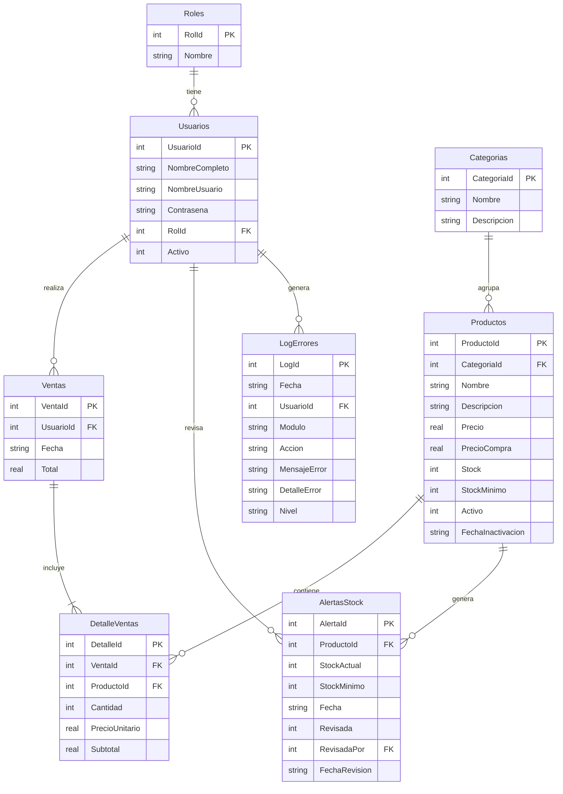

# Manual de Presentación del Proyecto: TiendaRopaCano

Este manual está diseñado para prepararte para la presentación de tu proyecto. Aquí encontrarás un resumen ordenado de cómo se trabajó, cómo está diseñada la base de datos, explicaciones de las partes más críticas del código y un cuestionario detallado con posibles preguntas que los evaluadores podrían hacerte, junto con sus respuestas técnicas justificadas.

---

## 1. Metodología de Trabajo y Desarrollo

Para el desarrollo del sistema **TiendaRopaCano POS**, se adoptaron buenas prácticas de ingeniería de software orientadas a la modularidad, mantenibilidad y seguridad.

*   **Arquitectura en 4 Capas (Clean Architecture adaptada):** Se estructuró la solución en proyectos separados para desacoplar la interfaz de usuario de las reglas de negocio y del acceso a datos.
*   **Desarrollo Orientado a Componentes (MVVM):** En la capa de presentación se utilizó el patrón **Model-View-ViewModel**, separando completamente el diseño visual en XAML de la lógica de negocios en C# con ViewModels.
*   **Gestión de Dependencias y Control de Cambios:** Se implementaron principios SOLID, inyección de dependencias (para conectar servicios y repositorios) y control de versiones con **Git** para mantener el historial del proyecto.
*   **Documentación de Código Activa:** Todas las clases, interfaces y métodos principales están documentados con comentarios XML (`/// 
`), permitiendo una fácil lectura e integración en cualquier IDE de desarrollo (Visual Studio).

---

## 2. Estructura y Diseño de la Base de Datos

La aplicación utiliza un motor de base de datos **SQLite** integrado (local), lo que permite que el sistema funcione de manera autónoma sin necesidad de instalar servidores de bases de datos pesados en la máquina cliente. La inicialización y creación de las tablas se realiza automáticamente al arrancar la aplicación si el archivo de la base de datos no existe.

El diseño relacional consta de **8 tablas** normalizadas para evitar la redundancia de datos:

### Detalle de las Tablas Principales:
1.  **`Roles`:** Catálogo de seguridad del sistema. Contiene dos roles por defecto: `Administrador` (permisos completos de inventario, usuarios y reportes) y `Vendedor` (acceso restringido a facturación y caja).
2.  **`Usuarios`:** Registra las cuentas de los empleados con contraseñas encriptadas y estado `Activo` para bajas lógicas.
3.  **`Categorias`:** Clasificación de las prendas de ropa (ej. Camisas, Jeans, Vestidos).
4.  **`Productos`:** Inventario de prendas de vestir. Controla el costo (`PrecioCompra`), el precio de venta (`Precio`), la cantidad disponible (`Stock`) y el límite de alerta (`StockMinimo`).
5.  **`Ventas`** y **`DetalleVentas`:** Relación Maestro-Detalle que registra la cabecera de la transacción (quién vendió, cuándo y cuánto) y las líneas individuales de artículos vendidos.
6.  **`AlertasStock`:** Tabla de eventos que se dispara automáticamente cuando un producto baja de su stock mínimo de seguridad.
7.  **`LogErrores`:** Tabla para auditoría y robustez del sistema, donde se guardan las excepciones imprevistas del código.

---

## 3. Defensa del Código: Preguntas Frecuentes y Respuestas Técnicas

A continuación se presentan las preguntas más probables que te harán los evaluadores acerca del código y la arquitectura del sistema, junto con la respuesta técnica exacta que debes dar.

---

### PREGUNTA 1: ¿Por qué utilizaste una Arquitectura en Capas en lugar de poner todo el código en las vistas (code-behind)?
*   **Respuesta Técnica:**
    > "Utilizamos una arquitectura en 4 capas para cumplir con el principio de **Separación de Responsabilidades**.
    > * **Capa de Dominio:** Es el núcleo central; contiene entidades de negocio puras independientes de cualquier base de datos o interfaz.
    > * **Capa de Datos (Infraestructura):** Se encarga únicamente del acceso a la base de datos SQLite y las consultas SQL.
    > * **Capa de Aplicación:** Contiene las reglas de negocio y orquestación (validación de stock, contraseñas, reportes en PDF).
    > * **Capa de Presentación:** Es la interfaz gráfica (WPF).
    > Esto facilita el mantenimiento, permite cambiar el motor de base de datos sin afectar a la interfaz visual, y hace posible realizar pruebas unitarias en la lógica del negocio."

---

### PREGUNTA 2: ¿Por qué elegiste usar Dapper en lugar de Entity Framework Core (EF Core)?
*   **Respuesta Técnica:**
    > "Elegimos **Dapper** porque es un **Micro-ORM** extremadamente ligero y rápido. Su rendimiento es casi idéntico al de ADO.NET puro, superando notablemente a EF Core en operaciones de lectura y escritura veloces.
    > Además, Dapper nos permite tener un **control absoluto sobre las consultas SQL escritas a mano**, garantizando que las consultas estén 100% optimizadas, sin que el ORM genere consultas complejas en segundo plano que ralenticen el sistema."

---

### PREGUNTA 3: ¿Cómo manejas la seguridad de las contraseñas de los usuarios en la base de datos?
*   **Respuesta Técnica:**
    > "Las contraseñas no se almacenan en texto plano bajo ninguna circunstancia. Implementamos la clase estática `EncriptadorContrasena` que utiliza el algoritmo **PBKDF2** (`Rfc2898DeriveBytes`) basado en SHA-256.
    > El proceso funciona así:
    > 1. Al crear un usuario, generamos un **Salt** aleatorio de 128 bits.
    > 2. Se deriva la clave aplicando **10,000 iteraciones** del algoritmo.
    > 3. Guardamos el resultado en la base de datos en una sola cadena con formato: `{Iteraciones}.{SaltBase64}.{HashBase64}`.
    > 4. Al iniciar sesión, se extraen las iteraciones y el salt, se calcula el hash con la contraseña ingresada y se comparan usando `CryptographicOperations.FixedTimeEquals` para prevenir **ataques de tiempo (timing attacks)**."

*   **Código clave a referenciar:** [PasswordHasher.cs](file:///c:/Users/admin/Desktop/Tienda%20de%20Ropa/TiendaRopaCano/TiendaRopaCano.Application/Helpers/PasswordHasher.cs)

---

### PREGUNTA 4: ¿Cómo garantizas que no haya pérdida de datos si ocurre un error a mitad de una transacción de venta?
*   **Respuesta Técnica:**
    > "Garantizamos la integridad de la información mediante **Transacciones de Base de Datos** a nivel del repositorio.
    > En el método `InsertarAsync` de `VentaRepository`, abrimos la conexión y llamamos a `con.BeginTransaction()`. Dentro de un bloque `try-catch`, realizamos tres operaciones secuenciales:
    > 1. Insertamos la cabecera de la venta (`Ventas`).
    > 2. Insertamos cada detalle del artículo comprado (`DetalleVentas`).
    > 3. Ejecutamos la actualización del stock del producto restando las unidades vendidas (`UPDATE Productos SET Stock = Stock - @Cantidad`).
    > Si alguna de estas operaciones falla, capturamos la excepción y ejecutamos `transaccion.Rollback()`, cancelando todo el proceso para que la base de datos quede intacta. Solo si todos los pasos se ejecutan de manera exitosa llamamos a `transaccion.Commit()`."

*   **Código clave a referenciar:** [VentaRepositorio.cs](file:///c:/Users/admin/Desktop/Tienda%20de%20Ropa/TiendaRopaCano/TiendaRopaCano.Data/Repositorios/VentaRepositorio.cs#L188-L235)

---

### PREGUNTA 5: ¿Cómo funciona el sistema de Alertas de Stock Bajo? ¿Dónde se detona?
*   **Respuesta Técnica:**
    > "El flujo de las alertas de stock bajo se controla desde la capa de aplicación (`ProductoService`) y se apoya en el repositorio:
    > 1. Cuando se actualiza un producto en el sistema (por ejemplo, al recibir mercancía o modificar sus datos) o cuando el stock se modifica manualmente mediante `ActualizarStockAsync`, el servicio evalúa el resultado.
    > 2. Si el stock actual es menor o igual al `StockMinimo` configurado para el producto, el servicio llama a `CrearAlertaStockAsync()`.
    > 3. Este método inserta de forma asíncrona una nueva entidad `AlertaStock` en la base de datos con la propiedad `Revisada = false` y la fecha de generación.
    > 4. Los usuarios administradores pueden visualizar estas alertas en la interfaz gráfica y marcarlas como revisadas."

*   **Código clave a referenciar:** [ProductoService.cs](file:///c:/Users/admin/Desktop/Tienda%20de%20Ropa/TiendaRopaCano/TiendaRopaCano.Application/Services/ProductoService.cs#L127-L148)

---

### PREGUNTA 6: ¿Cómo funciona el enlace de datos (Data Binding) y el patrón MVVM que utilizas en WPF?
*   **Respuesta Técnica:**
    > "Utilizamos el patrón **MVVM** para desacoplar la interfaz gráfica.
    > * La **Vista** (XAML) se limita a definir el diseño visual y enlazar sus controles a las propiedades del ViewModel usando la sintaxis `{Binding NombrePropiedad}`.
    > * El **ViewModel** expone los datos necesarios y los métodos a ejecutar. Para evitar escribir manualmente el boilerplate de notificación de cambios (`INotifyPropertyChanged`), utilizamos **CommunityToolkit.Mvvm**.
    > * Al decorar nuestras propiedades con el atributo `[ObservableProperty]`, los generadores de código de C# crean automáticamente la propiedad pública que notifica los cambios a la UI.
    > * Los eventos de los botones se enlazan mediante comandos decorados con el atributo `[RelayCommand]`, lo que permite asociar un clic de botón directamente a un método del ViewModel sin escribir código C# en el archivo de la vista (`.xaml.cs`)."

---

### PREGUNTA 7: ¿Qué sucede cuando ocurre una excepción inesperada en el sistema? ¿Cómo aseguras que el usuario no vea una pantalla azul o que se pierda la pista del error?
*   **Respuesta Técnica:**
    > "Implementamos una capa de persistencia y logging para la auditoría de errores a través del repositorio `LogErrorRepository`.
    > Cada servicio de la capa de aplicación está envuelto en bloques `try-catch`. Si una consulta falla o hay un error de red o lectura:
    > 1. Capturamos el objeto `Exception`.
    > 2. Invocamos de manera segura y asíncrona el método privado `RegistrarLogAsync`.
    > 3. Creamos un registro `LogError` que contiene la fecha, el módulo afectado (ej. Inventario o Ventas), la acción (ej. ObtenerPorIdAsync), el mensaje de error plano y la traza completa de la pila (`ex.ToString()`).
    > 4. Finalmente, propagamos el error de manera controlada para que la interfaz muestre una advertencia amigable al usuario en lugar de colapsar la aplicación."

---

### PREGUNTA 8: ¿Qué tecnología utilizas para generar los reportes y facturas en PDF y por qué?
*   **Respuesta Técnica:**
    > "Utilizamos la librería **QuestPDF**. A diferencia de las librerías tradicionales de PDF que se basan en renderizar código HTML lento o motores obsoletos, QuestPDF utiliza un motor de diseño fluido de alto rendimiento.
    > Define los PDF mediante código C# declarativo (Fluent API) con estructuras limpias como `Row`, `Column`, `Table` y `Grid`, garantizando que la paginación, los encabezados y pies de página se rendericen de manera exacta y rápida a partir de un arreglo de bytes en memoria, sin necesidad de escribir archivos temporales en el disco."

*   **Código clave a referenciar:** [PdfService.cs](file:///c:/Users/admin/Desktop/Tienda%20de%20Ropa/TiendaRopaCano/TiendaRopaCano.Application/Services/PdfService.cs)

---

## 4. Consejos Clave para tu Presentación de Mañana

1.  **Comienza con el Problema y la Solución:** No abras el código inmediatamente. Explica que el proyecto soluciona una necesidad real: *administrar las ventas en caja de una tienda de ropa de forma ágil, controlar su stock mínimo para no quedarse sin mercancía, y emitir reportes financieros inmediatos.*
2.  **Muestra un Flujo Completo (Demo en Vivo):**
    *   Inicia sesión con un usuario.
    *   Muestra el inventario e identifica un producto con stock bajo.
    *   Simula una venta rápida en caja y muestra cómo se descuenta automáticamente el stock.
    *   Genera el ticket PDF de la venta para demostrar la integración.
    *   Ve al módulo de reportes y muestra cómo se visualiza el gráfico de ganancias.
3.  **Destaca la Robustez Técnica:** Menciona la transaccionalidad de las ventas (Pregunta 4) y la seguridad de las contraseñas (Pregunta 3). Eso demuestra que no es un proyecto escolar básico, sino que pensaste en la seguridad y estabilidad en producción.
4.  **Mantén la Calma:** Si los evaluadores te piden ver el código de una parte, usa este manual. La estructura está tan limpia que podrás navegar fácilmente entre proyectos (`Domain`, `Application`, `Data`, `Presentation`).
